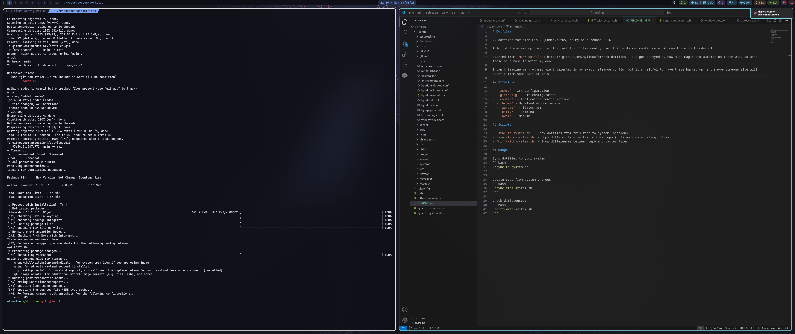

# Dotfiles

My dotfiles for Arch Linux (EndeavourOS) on my Asus Zenbook S16.

A lot of these are optimzed for the fact that I frequently use it in a docked config on a big monitor with Thunderbolt.

Started from [ML4W dotfiles](https://github.com/mylinuxforwork/dotfiles), but got annoyed by how much magic and automation there was, so used those as a base to write my own.

I can't imagine many others are interested in my exact, strange config, but it's helpful to have these backed up, and maybe someone else will benefit from some part of this.



## Structure

- `.zshrc` - Zsh configuration
- `.gitconfig` - Git configuration  
- `.config/` - Application configurations
  - `hypr/` - Hyprland window manager
  - `waybar/` - Status bar
  - `kitty/` - Terminal
  - `nvim/` - Neovim
- `etc/` - System configuration files
  - `greetd/` - Login manager
  - `systemd/logind.conf` - Lid switch and power management
  - `tlp.conf` - Power management
  - `keyd/` - Keyboard remapping
  - `udev/rules.d/` - Custom udev rules for docking
- `scripts/` - Custom scripts installed to `/usr/local/bin`
  - `handle-lid-switch.sh` - Manages lid behavior when docked
  - `display-mode-switch.sh` - Display configuration switching
  - `hyprland-wrapped` - Hyprland wrapper script to unlock keyring

## Scripts

- `sync-to-system.sh` - Copy dotfiles from repo to system (use `--system` flag for /etc and /usr/local/bin files)
- `sync-from-system.sh` - Copy dotfiles from system to repo (includes all tracked files)
- `diff-with-system.sh` - Show differences between repo and system files

## Usage

Sync dotfiles to system:
```bash
./sync-to-system.sh
```

Update repo from system:
```bash
./sync-from-system.sh
```

Check differences:
```bash
./diff-with-system.sh
```